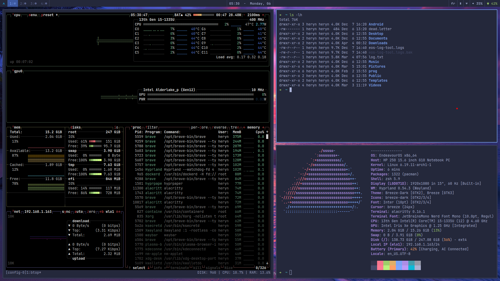

# Dotfiles

## tokyonight-storm palette

| Role | Color |
|---|---|
| Background | `#24283b` |
| Background alt | `#1f2335` |
| Selected bg | `#3d59a1` |
| Foreground | `#c0caf5` |
| Accent blue | `#7aa2f7` |
| Border | `#3b4261` |
| Muted | `#565f89` |
| Urgent | `#f7768e` |

## UI Style

**Terminal-Core / TUI aesthetic** — every UI element follows terminal design principles.

- Sharp corners, no border radius
- Monospace font (JetBrains Mono)
- Minimal padding, tight spacing
- Single-line borders in muted border color
- `> ` prompt prefix on inputs
- One accent color (blue) for focus/selection, everything else in foreground/muted
